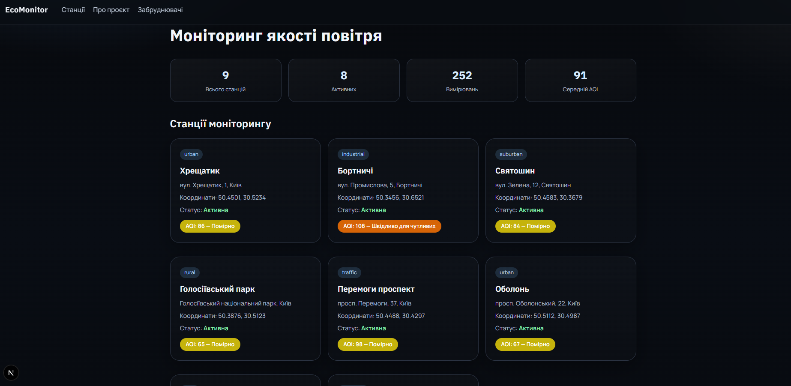
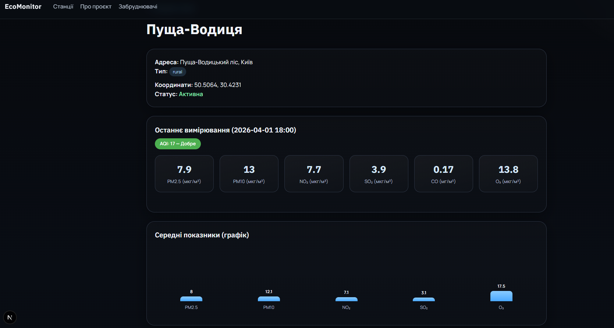
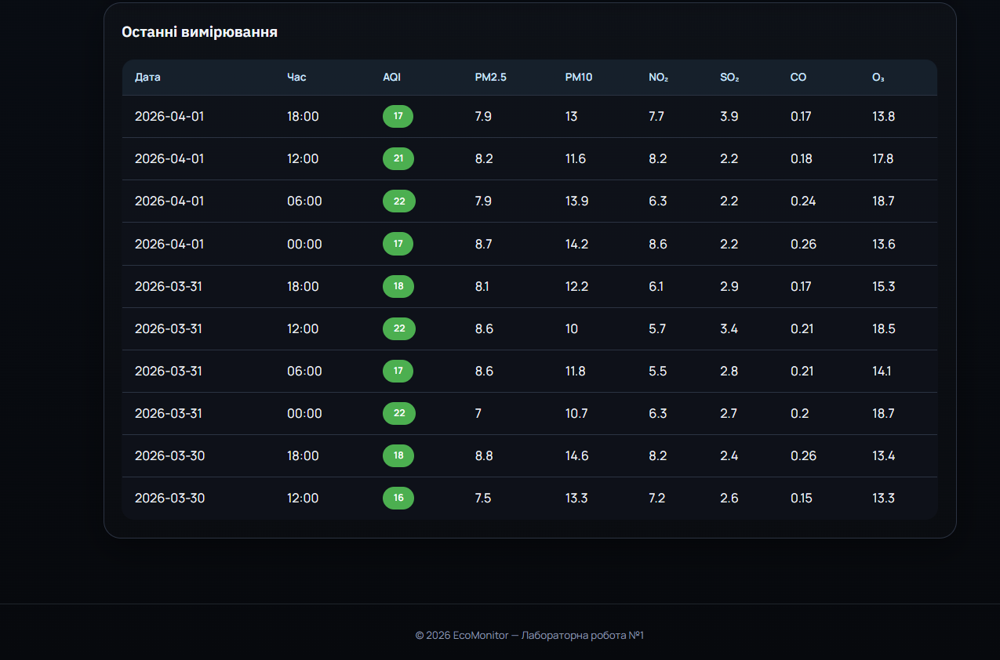
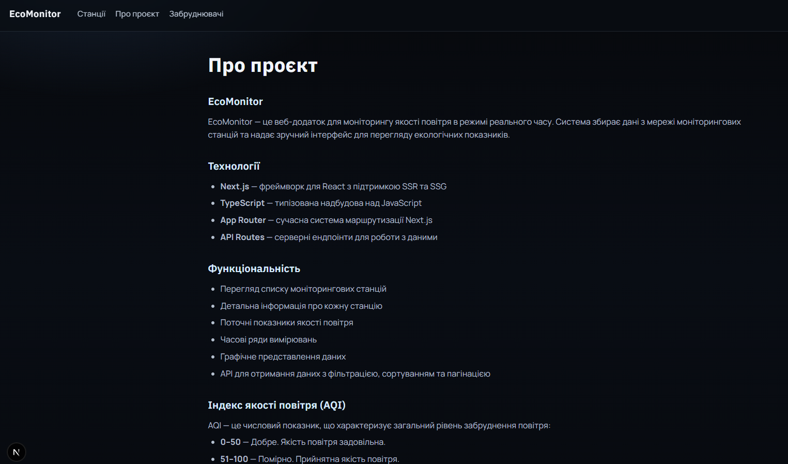
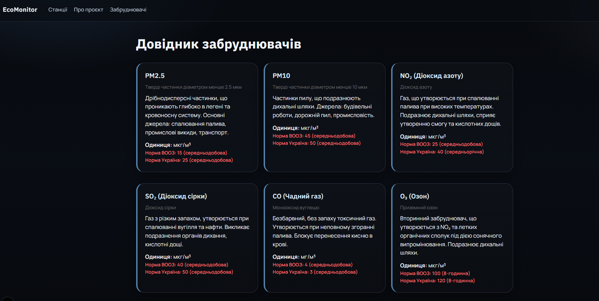
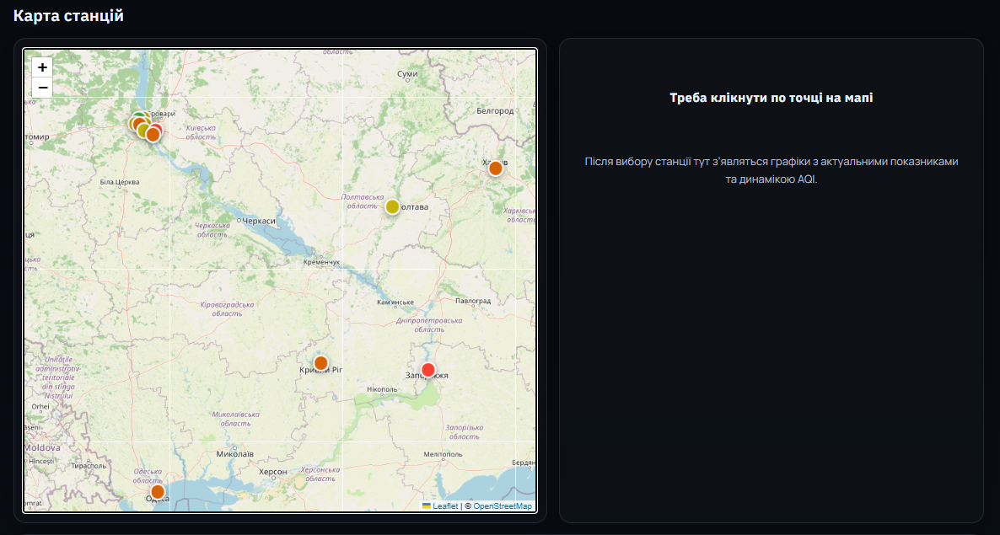
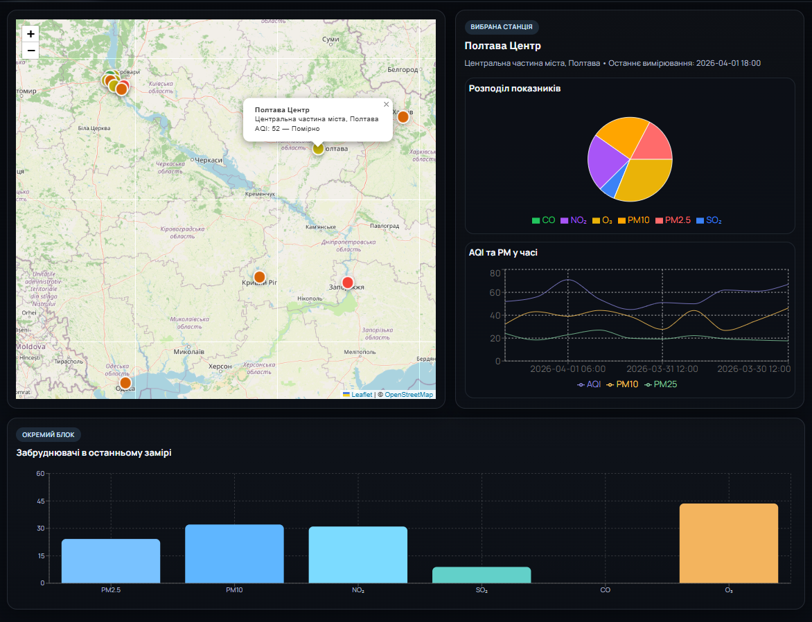
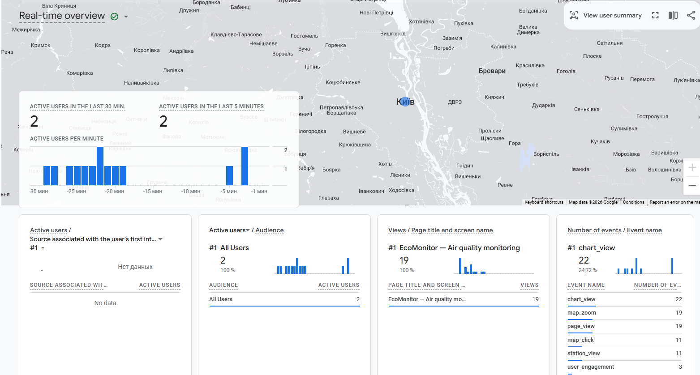

# EcoMonitor — Звіти з лабораторних робіт

## Зміст

- [Лабораторна робота №1 — Next.js і TypeScript](#лабораторна-робота-1)
- [Лабораторна робота №2 — Інтерактивна карта та графіки](#лабораторна-робота-2)
- [Лабораторна робота №3 — Аналітика та логування](#лабораторна-робота-3)

---

# Лабораторна робота №1

**Тема:** Створення веб-додатку на Next.js і TypeScript для моніторингу екологічних даних.

**Мета:** отримати практичні навички побудови застосунку з серверним рендерингом, статичною генерацією сторінок, API-маршрутами та типобезпечною роботою зі структурованими даними.

## Структура проєкту

```
lab1/
├── app/
│   ├── layout.tsx              # Головний layout, навігація та футер
│   ├── globals.css             # Глобальні стилі
│   ├── page.tsx                # Головна сторінка зі списком станцій (SSR)
│   ├── station/[id]/page.tsx   # Детальна сторінка станції (SSR)
│   ├── about/page.tsx          # Сторінка про проєкт (SSG)
│   ├── pollutants/page.tsx     # Довідник забруднювачів (SSG)
│   └── api/
│       ├── current/route.ts        # GET /api/current
│       ├── measurements/route.ts   # GET /api/measurements
│       ├── stations/route.ts       # GET /api/stations
│       └── stations/[id]/route.ts   # GET /api/stations/:id
├── data/
│   ├── stations.ts             # Тестові дані моніторингових станцій
│   └── measurements.ts         # Генерація часових рядів вимірювань
├── lib/
│   └── utils.ts                # Допоміжні функції для AQI та усереднення
├── types/
│   └── index.ts                # Спільні TypeScript-типи та інтерфейси
├── next.config.ts              # Конфігурація Next.js
├── tsconfig.json               # Конфігурація TypeScript
└── package.json
```

## Призначення основних каталогів

`app/` містить сторінки, layout і серверні API-маршрути. Саме тут реалізовано основну логіку інтерфейсу та отримання даних.

`data/` зберігає локальні тестові набори даних. У цьому проєкті вони імітують мережу екологічних станцій та часові ряди вимірювань.

`lib/` використовується для повторно застосовуваних функцій, наприклад для розрахунку середніх значень та визначення рівня AQI.

`types/` містить спільні інтерфейси, які використовуються і на сервері, і на клієнті. Це основа типобезпечної взаємодії в проєкті.

## TypeScript-інтерфейси

У файлі `types/index.ts` описані такі основні інтерфейси:

`AirQualityData` — структура показників якості повітря. Містить значення PM2.5, PM10, NO2, SO2, CO, O3 та AQI.

`MonitoringStation` — опис моніторингової станції: ідентифікатор, назва, координати, тип, адреса та статус активності.

`Measurement` — одне вимірювання для конкретної станції з датою, часом і вкладеним об’єктом `airQuality`.

`StationsRequest` — параметри фільтрації для запиту списку станцій.

`MeasurementsRequest` — параметри вибірки вимірювань: станція, діапазон дат, пагінація, сортування.

`ApiResponse<T>` — універсальний формат успішної відповіді API.

`PaginatedResponse<T>` — відповідь API з пагінацією.

`ApiError` — стандартизована структура помилки.

Ці інтерфейси знижують ризик помилок під час роботи з даними та дозволяють безпечно використовувати спільні типи в різних частинах застосунку.

## SSR, SSG та призначення сторінок

### SSR

Головна сторінка `app/page.tsx` і сторінка станції `app/station/[id]/page.tsx` побудовані як серверно-рендерені. У коді для них використано `export const dynamic = "force-dynamic"`, тому HTML формується на сервері під час кожного запиту.

SSR тут доцільний, тому що дані про стан повітря мають бути актуальними, а користувач повинен одразу бачити готовий вміст без додаткового очікування на клієнті.

### SSG

Сторінки `app/about/page.tsx` і `app/pollutants/page.tsx` є статичними. Їхній контент змінюється рідко, тому зручно згенерувати їх під час збірки.

SSG підходить для довідкової інформації, опису технологій, шкали AQI та пояснення забруднювачів.

### Коли використовувати ISR

ISR доцільно застосовувати для сторінок, де контент не змінюється щосекунди, але повинен періодично оновлюватися без повної повторної збірки. Для цього проєкту це могли б бути:

- добові або тижневі звіти по станціях;
- сторінки з агрегованою аналітикою по районах;
- дашборд з підсумками за останні 24 години.

## API та приклади запитів

### GET /api/stations

Повертає список станцій. Підтримує фільтрацію за типом і статусом активності.

Приклад запиту:

```text
GET /api/stations?type=urban&active=true
```

### GET /api/stations/:id

Повертає деталі конкретної станції, останнє вимірювання та середнє значення за сьогодні.

Приклад запиту:

```text
GET /api/stations/station-1
```

### GET /api/measurements

Повертає вимірювання з фільтрацією за станцією та датами, а також із пагінацією і сортуванням.

Приклад запиту:

```text
GET /api/measurements?stationId=station-1&startDate=2026-04-01&endDate=2026-04-07&page=1&limit=5&sortBy=aqi&sortOrder=desc
```

### GET /api/current

Повертає поточні показники для всіх активних станцій.

Приклад запиту:

```text
GET /api/current
```

### Приклад успішної відповіді

```json
{
  "success": true,
  "data": [
    {
      "station": {
        "id": "station-1",
        "name": "Хрещатик",
        "latitude": 50.4501,
        "longitude": 30.5234,
        "type": "urban",
        "address": "вул. Хрещатик, 1, Київ",
        "active": true
      },
      "current": {
        "pm25": 32.5,
        "pm10": 48.2,
        "no2": 38.1,
        "so2": 11.4,
        "co": 0.72,
        "o3": 42.8,
        "aqi": 65
      },
      "measuredAt": "2026-04-01T00:00"
    }
  ],
  "timestamp": "2026-04-06T12:00:00.000Z"
}
```

### Приклад помилки

```json
{
  "success": false,
  "error": {
    "code": "NOT_FOUND",
    "message": "Станцію з id \"station-999\" не знайдено"
  },
  "timestamp": "2026-04-06T12:00:00.000Z"
}
```

## Ключові фрагменти коду

### Строга типізація

У `tsconfig.json` увімкнено суворий режим TypeScript. Це означає, що компілятор виявляє більше помилок ще до запуску застосунку.

```json
{
  "compilerOptions": {
    "strict": true,
    "noUncheckedIndexedAccess": true,
    "noUnusedLocals": true,
    "noUnusedParameters": true,
    "noFallthroughCasesInSwitch": true
  }
}
```

### Серверний рендеринг головної сторінки

```tsx
export const dynamic = "force-dynamic";

export default async function HomePage() {
  const activeStations = stations.filter((s) => s.active);
  const allMeasurementsFlat = measurements.filter((m) =>
    activeStations.some((s) => s.id === m.stationId)
  );
  const overallAvg = calculateAverage(allMeasurementsFlat);

  return <div className="container">...</div>;
}
```

Цей фрагмент показує, що дані готуються на сервері перед рендером сторінки.

### Типобезпечний API-формат

```ts
export interface ApiResponse<T> {
  success: boolean;
  data: T;
  timestamp: string;
}

export interface PaginatedResponse<T> extends ApiResponse<T[]> {
  page: number;
  limit: number;
  total: number;
  totalPages: number;
}
```

Завдяки дженерикам структура відповіді однакова для різних типів даних, але при цьому залишається строго типізованою.

### Валідація запиту в API

```ts
if (!stationId) {
  return NextResponse.json(
    {
      success: false,
      error: { code: "MISSING_PARAM", message: "Параметр stationId є обов'язковим" },
      timestamp: new Date().toISOString(),
    },
    { status: 400 }
  );
}
```

Цей підхід допомагає уникнути некоректних запитів і робить API передбачуваним для клієнта.

## Переваги серверного рендерингу для наукових даних

SSR особливо корисний у проєктах з екологічним моніторингом, тому що:

- перший корисний контент показується швидше, оскільки HTML приходить уже готовим;
- пошукові системи краще індексують контент;
- важкі обчислення можна виконувати на сервері, не перевантажуючи браузер;
- дані відображаються актуальнішими на момент запиту;
- простіше контролювати формат і цілісність даних.

## Як TypeScript підвищує надійність коду

TypeScript зменшує кількість помилок завдяки статичній перевірці типів, спільним інтерфейсам і обмеженню допустимих значень. Для екологічних даних це важливо, бо структура вимірювань має бути стабільною: одне неправильне поле або невірний тип можуть зламати розрахунок AQI чи відображення графіків.

У цьому проєкті TypeScript допомагає:

- описати структуру станцій та вимірювань;
- безпечно працювати з параметрами API;
- використовувати однакові типи на сервері й клієнті;
- отримувати підказки в редакторі та швидше знаходити помилки.

## Коли доцільно використовувати SSR, SSG та ISR

SSR варто використовувати для даних, що часто змінюються. У цьому проєкті це головна сторінка зі списком станцій і детальна сторінка конкретної станції.

SSG підходить для майже незмінного контенту. Тут це сторінки `Про проєкт` і `Довідник забруднювачів`.

ISR доцільний, коли сторінку потрібно оновлювати періодично, але не на кожен запит. Наприклад, для щоденного зведення по якості повітря або тижневої статистики.

## Принципи організації API

Щоб API було масштабованим, у проєкті важливо дотримуватися таких принципів:

- чіткий поділ ресурсів на окремі маршрути;
- однаковий формат успішних відповідей і помилок;
- валідація вхідних параметрів;
- пагінація для великих списків;
- фільтрація та сортування через query-параметри;
- повторне використання спільних типів;
- мінімум логіки в маршрутах і максимум зрозумілих допоміжних функцій.

## Типобезпечна взаємодія між клієнтом і сервером

Безпечна взаємодія реалізується через спільні типи в `types/index.ts`. Серверні маршрути повертають дані у форматі `ApiResponse<T>` або `PaginatedResponse<T>`, а клієнтські сторінки працюють з такими ж інтерфейсами.

Це дає дві переваги: однакове розуміння структури даних на обох сторонах і менше шансів на помилки під час зміни API.

### 1. Головна сторінка



### 2. Сторінка станції




### 3. Сторінка "Про проєкт"



### 4. Довідник забруднювачів



## Висновки

У ході лабораторної роботи створено веб-додаток EcoMonitor для моніторингу якості повітря. Реалізовано серверний рендеринг для динамічних сторінок, статичну генерацію для довідкових сторінок, чотири API-маршрути з валідацією й типобезпечні спільні моделі даних.

Проєкт показує, що Next.js з App Router зручно підходить для наукових і екологічних даних, а TypeScript робить обробку структурованої інформації більш надійною та передбачуваною.

---

# Лабораторна робота №2

**Тема:** Інтеграція інтерактивної карти та графіків

**Мета:** навчитися інтегрувати картографічні бібліотеки та інструменти візуалізації для створення інтерактивного інтерфейсу відображення екологічних даних.

## Нові залежності

До проєкту додано дві бібліотеки:

- `leaflet` та `react-leaflet` — для відображення інтерактивної карти на основі OpenStreetMap
- `recharts` — для побудови графіків на основі SVG + React

Встановлення:

```bash
npm install leaflet react-leaflet recharts
npm install --save-dev @types/leaflet
```

## Нова структура файлів
app/
monitor/
page.tsx                    # Головна сторінка моніторингу (карта + графіки)
components/
Map.tsx                     # Клієнтський компонент карти (Leaflet)
HomeMapSection.tsx          # Обгортка для карти на головній сторінці
charts/
LineChart.tsx             # Лінійний графік динаміки AQI
BarChart.tsx              # Стовпчаста діаграма порівняння станцій
PieChart.tsx              # Кругова діаграма структури забруднення

## Частина 1. Інтерактивна карта

### Особливість інтеграції Leaflet у Next.js

Leaflet напряму звертається до браузерних API (`window`, `document`), яких немає під час серверного рендерингу. Щоб уникнути помилки `window is not defined`, компонент карти підключається через `dynamic import` з параметром `ssr: false`:

```tsx
import dynamicImport from 'next/dynamic'

const Map = dynamicImport(() => import('@/app/components/Map'), {
  ssr: false,
})
```

Важливо перейменувати імпорт на `dynamicImport`, оскільки Next.js резервує ідентифікатор `dynamic` для директиви `export const dynamic = "force-dynamic"`. Конфлікт імен призведе до помилки збірки.

### Маркери з кольоровим кодуванням

Замість стандартних іконок Leaflet використовуються кастомні `L.divIcon` — кольорові кола, де колір визначається функцією `getAqiLevel()` вже наявною у проєкті. Це дає змогу одразу бачити рівень забруднення на карті без відкриття спливаючого вікна.

Ще одна поширена проблема — Leaflet не знаходить свої PNG-іконки через webpack. Вирішується явним перевизначенням шляхів через CDN:

```tsx
delete (L.Icon.Default.prototype as any)._getIconUrl
L.Icon.Default.mergeOptions({
  iconUrl: 'https://unpkg.com/leaflet@1.9.4/dist/images/marker-icon.png',
  shadowUrl: 'https://unpkg.com/leaflet@1.9.4/dist/images/marker-shadow.png',
})
```

### Скріншот карти зі станціями



## Частина 2. Графіки

Для побудови графіків використовується бібліотека Recharts. Усі компоненти графіків є клієнтськими (`'use client'`) і приймають дані через пропси — обчислення залишаються на сервері.

### Лінійний графік

`LineChart.tsx` показує зміну AQI, PM2.5 і PM10 у часі для обраної станції. Дані вимірювань перетворюються у масив об'єктів з ключами, які відповідають іменам ліній. `ResponsiveContainer` автоматично адаптує ширину графіка до контейнера. `dot={false}` прибирає крапки на вузлових точках — при великій кількості вимірювань це суттєво покращує читабельність.

### Стовпчаста діаграма

`BarChart.tsx` порівнює AQI по всіх станціях. Використовується вертикальне компонування (`layout="vertical"`), що зручніше для довгих назв станцій. Кожен стовпець фарбується індивідуально через компонент `Cell` — колір береться з `getAqiLevel()`.

### Кругова діаграма

`PieChart.tsx` відображає структуру забруднення для останнього вимірювання: частку кожного забруднювача (PM2.5, PM10, NO₂, SO₂, CO, O₃) у загальному показнику.

### Скріншот графіків



## Частина 3. Інтеграція карти та графіків

### Архітектура зв'язку між компонентами

Ключова ідея — спільний стан `selectedStationId` живе у батьківській сторінці `app/monitor/page.tsx` і передається і в карту, і в блок графіків. Коли користувач клікає на маркер, карта викликає колбек `onStationSelect(id)`, батьківський компонент оновлює стан, а `useEffect` автоматично завантажує вимірювання для нової станції.

### Розподіл серверної та клієнтської логіки

Серверні компоненти Next.js не можуть мати стан. Тому обчислення (фільтрація станцій, побудова словника `stationId → aqi`) виконується на сервері, а готові дані передаються в клієнтські компоненти через пропси. Це стандартний патерн App Router: мінімум клієнтського коду, максимум серверної роботи.

### Перемикач типів графіків

На сторінці моніторингу реалізовано три режими перегляду: динаміка AQI у часі, порівняння всіх станцій і структура забруднення. Активний режим зберігається у стані `activeChart` і змінюється кнопками-перемикачами.

## Контрольні запитання
### 1. Чому виникають проблеми при інтеграції картографічних бібліотек у Next.js і як їх вирішити?
Проблеми при інтеграції картографічних бібліотек у Next.js виникають через те, що цей фреймворк використовує серверний рендеринг, тоді як бібліотеки на кшталт Leaflet працюють лише в браузері та залежать від об’єктів window і document. Через це з’являються помилки під час рендерингу на сервері. Вирішується це шляхом вимкнення SSR для таких компонентів через динамічний імпорт, а також перевіркою, чи код виконується на клієнті.

### 2.Які типи графіків найкраще підходять для візуалізації різних екологічних показників?
Для візуалізації екологічних показників найкраще підходять різні типи графіків залежно від характеру даних. Лінійні графіки доцільно використовувати для відображення змін показників у часі, наприклад рівня забруднення протягом днів. Стовпчикові діаграми добре підходять для порівняння значень між різними станціями або регіонами. Кругові діаграми використовуються для показу структури забруднення, тобто співвідношення різних речовин у загальному обсязі.

### 3. Як організувати ефективну взаємодію між різними компонентами інтерфейсу?
Ефективну взаємодію між компонентами інтерфейсу зазвичай організовують через спільний стан. Дані про обрану станцію зберігаються в батьківському компоненті, а дочірні компоненти отримують їх через props. Коли користувач натискає на маркер на карті, стан оновлюється, і відповідно змінюється відображення графіків. У більш складних застосунках можуть використовуватись додаткові інструменти керування станом, такі як Context API або спеціалізовані бібліотеки.

### 4. Які фактори впливають на продуктивність карти при великій кількості маркерів?
Продуктивність карти при великій кількості маркерів залежить від кількох факторів, зокрема від обсягу відображуваних даних, частоти перерендерів компонентів і складності візуальних елементів, таких як спливаючі вікна. Велика кількість маркерів може суттєво уповільнювати роботу інтерфейсу. Для оптимізації використовують кластеризацію маркерів, зменшення кількості одночасно відображуваних елементів, а також різні техніки оптимізації React-компонентів.

## Висновки

У ході лабораторної роботи реалізовано інтерактивну карту моніторингових станцій на основі Leaflet з кольоровим кодуванням за рівнем AQI та спливаючими вікнами. Підключено три типи графіків через Recharts: лінійний, стовпчастий і круговий. Карту та графіки зв'язано через спільний стан батьківського компонента.

Вирішено ключові технічні задачі: обхід обмежень SSR для Leaflet через `dynamic import`, усунення конфлікту імен між `next/dynamic` і директивою `export const dynamic`, правильний розподіл серверної та клієнтської логіки в архітектурі Next.js App Router.

---

# Лабораторна робота №3

**Тема:** Впровадження аналітики та логування

**Мета:** навчитися інтегрувати системи веб-аналітики для відстеження користувацької активності та реалізувати серверне логування для моніторингу роботи додатку.

## Нові залежності

```bash
npm install pino pino-pretty
```

`pino` — надшвидкий JSON-логер для Node.js зі структурованим виводом.  
`pino-pretty` — форматувальник для читабельного виводу у режимі розробки.

## Нові файли

```
lib/
  logger.ts                     # Pino-логер для серверної частини
  analytics.ts                  # Клієнтська аналітика + GA4 інтеграція
app/
  components/
    AnalyticsProvider.tsx       # GA4 script injection + відстеження маршрутів
    ErrorBoundary.tsx           # React Error Boundary
  not-found.tsx                 # Кастомна сторінка 404
  error.tsx                     # Кастомна сторінка 500
  global-error.tsx              # Глобальний обробник критичних помилок
middleware.ts                   # Next.js Middleware — логування HTTP-запитів
```

## Частина 1. Веб-аналітика

### Архітектура аналітики

Аналітика побудована у два рівні:

1. **Google Analytics 4** — підключається через `NEXT_PUBLIC_GA_MEASUREMENT_ID` у `.env.local`. Якщо змінна не задана — GA4 скрипт не вантажиться, додаток працює без нього.
2. **Консольні події** — у режимі `NODE_ENV=development` усі аналітичні події дублюються в консоль для відлагодження.

### Інтеграція GA4 — `app/components/AnalyticsProvider.tsx`

```tsx
export default function AnalyticsProvider() {
  const pathname = usePathname()

  useEffect(() => { getSessionStartTime() }, [])
  useEffect(() => { trackPageView(pathname) }, [pathname])

  if (!GA_MEASUREMENT_ID) return null

  return (
    <>
      <Script src={`https://www.googletagmanager.com/gtag/js?id=${GA_MEASUREMENT_ID}`}
              strategy="afterInteractive" />
      <Script id="ga-init" strategy="afterInteractive">
        {`
          window.dataLayer = window.dataLayer || [];
          function gtag(){dataLayer.push(arguments);}
          gtag('js', new Date());
          gtag('config', '${GA_MEASUREMENT_ID}', { page_path: window.location.pathname });
        `}
      </Script>
    </>
  )
}
```

Компонент підключається один раз у `app/layout.tsx` і автоматично відстежує всі переходи між маршрутами через хук `usePathname`.

### Кастомні події — `lib/analytics.ts`

```ts
export type AnalyticsEvent =
  | { name: 'station_view'; stationId: string; stationName: string }
  | { name: 'map_click'; stationId: string }
  | { name: 'map_zoom'; zoomLevel: number }
  | { name: 'chart_view'; chartType: 'line' | 'bar' | 'pie' }
  | { name: 'filter_apply'; filterName: string; filterValue: string }
  | { name: 'data_export'; format: string }

export function trackEvent(event: AnalyticsEvent): void {
  const { name, ...params } = event
  if (typeof window.gtag === 'function') {
    window.gtag('event', name, params)
  }
  if (process.env.NODE_ENV === 'development') {
    console.info('[Analytics]', name, params)
  }
}
```

Дискримінований union-тип `AnalyticsEvent` забезпечує типобезпечну передачу параметрів — TypeScript не дасть відправити подію з неправильними полями.

### Де відстежуються події

| Подія | Де викликається | Параметри |
|---|---|---|
| `station_view` | `HomeMapSection` при кліку на маркер | `stationId`, `stationName` |
| `map_click` | `Map.tsx` в `eventHandlers.click` | `stationId` |
| `map_zoom` | `Map.tsx` через `ZoomTracker` | `zoomLevel` |
| `chart_view` | `HomeMapSection` через `useEffect` | `chartType` |
| `page_view` | `AnalyticsProvider` при зміні `pathname` | `url` |

### Відстеження тривалості сесії

```ts
export function getSessionStartTime(): number {
  const stored = sessionStorage.getItem('eco_session_start')
  if (stored) return Number(stored)
  const now = Date.now()
  sessionStorage.setItem('eco_session_start', String(now))
  return now
}

export function getSessionDuration(): number {
  return Math.round((Date.now() - getSessionStartTime()) / 1000)
}
```

Час початку сесії зберігається у `sessionStorage` і скидається при закритті вкладки.

### Приклад виводу аналітики в консолі (dev)

```
[Analytics] page_view { url: '/' }
[Analytics] map_click { stationId: 'station-3' }
[Analytics] station_view { stationId: 'station-3', stationName: 'Оболонь' }
[Analytics] chart_view { chartType: 'pie' }
[Analytics] chart_view { chartType: 'line' }
[Analytics] map_zoom { zoomLevel: 8 }
```
### Результат:



## Частина 2. Серверне логування

### Logger — `lib/logger.ts`

```ts
import pino from 'pino'

const logger = pino({
  level: process.env.LOG_LEVEL ?? 'info',
  formatters: {
    level(label) { return { level: label } },
  },
  base: { service: 'ecomonitor' },
  transport: isDev
    ? {
        target: 'pino-pretty',
        options: {
          colorize: true,
          translateTime: 'SYS:yyyy-mm-dd HH:MM:ss',
          ignore: 'pid,hostname,service',
        },
      }
    : undefined,
})
```

У розробці логи форматуються через `pino-pretty` з кольоровим виводом. У продакшні виводиться чистий JSON — зручно для інструментів збору логів (Datadog, CloudWatch, Loki тощо).

### Рівні логування

| Рівень | Метод | Призначення |
|---|---|---|
| `debug` | `logger.debug(...)` | Деталі для відлагодження (вимкнено за замовчуванням) |
| `info` | `logger.info(...)` | Вхідні запити, успішні операції |
| `warn` | `logger.warn(...)` | Неправильні параметри, відсутні ресурси (404) |
| `error` | `logger.error(...)` | Необроблені виключення (500) |

Керування рівнем — через змінну середовища `LOG_LEVEL=debug`.

### Приклади структурованих лог-записів

Лог для успішного запиту (info):

```json
{
  "timestamp": "2026-04-29 14:22:10",
  "level": "info",
  "service": "ecomonitor",
  "msg": "GET /api/stations",
  "query": { "type": "urban", "active": "true" }
}
```

Лог для відсутньої станції (warn):

```json
{
  "timestamp": "2026-04-29 14:22:15",
  "level": "warn",
  "service": "ecomonitor",
  "msg": "Station not found",
  "stationId": "station-999"
}
```

Лог серверної помилки (error):

```json
{
  "timestamp": "2026-04-29 14:22:20",
  "level": "error",
  "service": "ecomonitor",
  "msg": "Unhandled error in GET /api/measurements"
}
```

### Middleware — `middleware.ts`

```ts
export function middleware(request: NextRequest) {
  const start = Date.now()
  const { pathname, search } = request.nextUrl
  const ip = request.headers.get('x-forwarded-for')?.split(',')[0]?.trim() ?? 'unknown'

  const response = NextResponse.next()

  const duration = Date.now() - start
  const status = response.status
  const level = status >= 500 ? 'ERROR' : status >= 400 ? 'WARN' : 'INFO'

  log(level, { msg: `${method} ${pathname}`, method, path: pathname,
               status, duration_ms: duration, ip, userAgent })

  response.headers.set('X-Response-Time', `${duration}ms`)
  return response
}
```

Middleware виконується в Edge Runtime, тому замість pino використовується власна функція `log()` з `JSON.stringify` — вона не залежить від Node.js API і сумісна з edge-середовищем.

Крім логування, Middleware додає заголовок `X-Response-Time` до кожної відповіді.

### Конфігурація matcher

```ts
export const config = {
  matcher: [
    '/((?!_next/static|_next/image|favicon.ico|.*\\.png$|.*\\.jpg$|.*\\.svg$).*)',
  ],
}
```

Статичні файли виключено з логування, щоб не засмічувати вивід.

### Приклади записів Middleware

```
{"timestamp":"2026-04-29T14:22:10.123Z","level":"INFO","service":"ecomonitor","msg":"GET /","method":"GET","path":"/","status":200,"duration_ms":4,"ip":"127.0.0.1","userAgent":"Mozilla/5.0..."}
{"timestamp":"2026-04-29T14:22:11.456Z","level":"INFO","service":"ecomonitor","msg":"GET /api/stations","method":"GET","path":"/api/stations","status":200,"duration_ms":2,"ip":"127.0.0.1","userAgent":"Mozilla/5.0..."}
{"timestamp":"2026-04-29T14:22:12.789Z","level":"WARN","service":"ecomonitor","msg":"GET /api/stations/station-999","method":"GET","path":"/api/stations/station-999","status":404,"duration_ms":1,"ip":"127.0.0.1","userAgent":"Mozilla/5.0..."}
```

## Частина 3. Обробка помилок

### Error Boundary — `app/components/ErrorBoundary.tsx`

```tsx
export default class ErrorBoundary extends Component<Props, State> {
  static getDerivedStateFromError(error: Error): State {
    return { hasError: true, error }
  }

  componentDidCatch(error: Error, info: ErrorInfo) {
    console.error(JSON.stringify({
      timestamp: new Date().toISOString(),
      level: 'error',
      service: 'ecomonitor',
      msg: 'React component error',
      error: error.message,
      stack: error.stack,
      componentStack: info.componentStack,
    }))
  }

  render() {
    if (this.state.hasError) {
      return (
        <div className="error-boundary">
          <h2>Щось пішло не так</h2>
          <button onClick={() => this.setState({ hasError: false, error: null })}>
            Спробувати ще раз
          </button>
        </div>
      )
    }
    return this.props.children
  }
}
```

`Error Boundary` перехоплює помилки у дочірніх React-компонентах, логує їх структуровано і показує резервний UI замість білого екрану. Кнопка "Спробувати ще раз" скидає стан помилки без перезавантаження сторінки.

### Кастомна сторінка 404 — `app/not-found.tsx`

```tsx
export default function NotFound() {
  return (
    <div className="container error-page">
      <div className="error-page-code">404</div>
      <h1 className="error-page-title">Сторінку не знайдено</h1>
      <p className="error-page-text">
        Сторінка, яку ви шукаєте, не існує або була переміщена.
      </p>
      <Link href="/" className="btn">На головну</Link>
    </div>
  )
}
```

### Кастомна сторінка 500 — `app/error.tsx`

```tsx
export default function ErrorPage({ error, reset }: ErrorPageProps) {
  useEffect(() => {
    console.error(JSON.stringify({
      timestamp: new Date().toISOString(),
      level: 'error',
      service: 'ecomonitor',
      msg: 'Unhandled page error',
      error: error.message,
      digest: error.digest,
    }))
  }, [error])

  return (
    <div className="container error-page">
      <div className="error-page-code">500</div>
      <h1 className="error-page-title">Помилка сервера</h1>
      <button onClick={reset}>Спробувати ще раз</button>
      <Link href="/" className="btn">На головну</Link>
    </div>
  )
}
```

Файл `app/error.tsx` — стандартний механізм Next.js App Router. Він автоматично обгортає вміст маршруту і отримує `error` та функцію `reset` як пропси.

### Глобальний обробник — `app/global-error.tsx`

Обробляє помилки, які виникають навіть у самому `layout.tsx`. Це крайній запобіжник — повинен повертати повноцінний HTML-документ без залежності від layout:

```tsx
export default function GlobalError({ error, reset }: GlobalErrorProps) {
  return (
    <html lang="uk">
      <body>
        <div style={{ padding: '2rem', textAlign: 'center' }}>
          <h1>Критична помилка</h1>
          <button onClick={reset}>Перезавантажити</button>
        </div>
      </body>
    </html>
  )
}
```

### Ієрархія обробки помилок

```
GlobalError (app/global-error.tsx)       ← помилки у layout.tsx
  └── ErrorPage (app/error.tsx)          ← помилки на рівні маршруту
        └── ErrorBoundary (компонент)    ← помилки у конкретному блоці
```

## Контрольні питання

### 1. Які метрики веб-аналітики найважливіші для екологічного моніторингового додатку?

Для EcoMonitor найважливіші метрики — це частота перегляду деталей станцій (показує, яким регіонам користувачі приділяють найбільше уваги), взаємодія з картою (клік на маркер, зум), перегляд графіків і тривалість сесії. Ці метрики дозволяють розуміти, які дані найбільш затребувані, і приймати рішення щодо розвитку функціоналу. Крім того, важливі показники завантаження сторінок — повільне завантаження зменшує залученість користувачів, що критично для сервісів реального часу.

### 2. Як structured logging полегшує аналіз проблем у продакшн-середовищі?

Structured logging виводить записи у форматі JSON з фіксованими полями (`timestamp`, `level`, `msg`, `service` тощо). Це дозволяє автоматично фільтрувати, індексувати та агрегувати логи в таких системах, як Loki, Datadog або CloudWatch Logs. На відміну від звичайних текстових рядків, JSON-записи зручно запитувати: наприклад, знайти всі помилки за останню годину або всі попередження для конкретної станції. Також structured logging полегшує кореляцію подій — можна простежити весь ланцюжок від HTTP-запиту до помилки в БД за спільним `requestId`.

### 3. Яку роль виконує Middleware у процесі логування запитів?

Middleware у Next.js — це функція, яка виконується перед обробкою кожного запиту. Вона ідеально підходить для логування, бо гарантовано перехоплює всі HTTP-запити незалежно від маршруту. Middleware записує метод, URL, код відповіді, час виконання та IP-адресу клієнта — без дублювання цього коду в кожному API-маршруті. У цьому проєкті Middleware також додає заголовок `X-Response-Time` до відповіді, що дозволяє клієнту або проксі бачити час обробки запиту.

### 4. Чому важлива багаторівнева обробка помилок у веб-додатках?

Різні помилки виникають на різних рівнях і потребують різної реакції. Помилка у конкретному React-компоненті (наприклад, у блоці графіка) не повинна ламати всю сторінку — `ErrorBoundary` ізолює проблему і показує резервний UI тільки для цього блоку. Помилка на рівні маршруту обробляється `app/error.tsx` і дозволяє користувачеві спробувати ще раз. Критична помилка в самому `layout.tsx` потрапляє в `global-error.tsx` — останній рубіж захисту. Така ієрархія мінімізує вплив помилок на користувача і одночасно забезпечує збір інформації для розробників.

## Висновки

У ході лабораторної роботи реалізовано повний стек моніторингу та обробки помилок для додатку EcoMonitor.

**Аналітика**: підключено Google Analytics 4 через `NEXT_PUBLIC_GA_MEASUREMENT_ID`, створено типобезпечний модуль `trackEvent` з дискримінованим union-типом, відстеження переходів між сторінками через `usePathname`, кастомні події для взаємодії з картою та графіками, механізм тривалості сесії через `sessionStorage`.

**Серверне логування**: pino-логер з JSON-виводом у продакшні та кольоровим `pino-pretty` у розробці, чотири рівні логування (debug/info/warn/error), Next.js Middleware для автоматичного логування всіх HTTP-запитів разом із кодом відповіді та часом виконання.

**Обробка помилок**: ієрархія з трьох рівнів — React `ErrorBoundary` для компонентів, `app/error.tsx` для маршрутів, `app/global-error.tsx` для критичних збоїв, кастомні сторінки 404 і 500 у єдиному стилі додатку.

